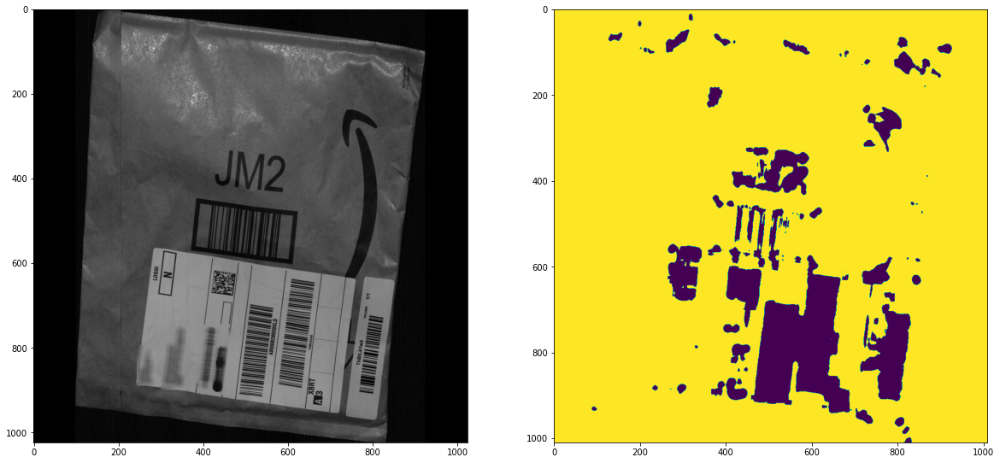

# (Generalized) Laws Textures

## Brief Introduction to Laws Textures

Laws Texture were introduced by Kenneth Laws on the paper *[Rapid Texture Identification](https://www.spiedigitallibrary.org/conference-proceedings-of-spie/0238/1/Rapid-Texture-Identification/10.1117/12.959169.short?SSO=1)*, in 1980. That paper summarizes his previous PhD work on [*Texture Image Segmentation*](https://apps.dtic.mil/sti/citations/ADA083283). 

Laws Textures are feature maps obtained using [separable filters](https://en.wikipedia.org/wiki/Separable_filter). To obtain them, Laws selected a small set of *basis vectors*: 

```
L3 = [ 1, 2, 1]
E3 = [-1, 0, 1]
S3 = [-1, 2,-1]
```

Larger vectors can be obtained by doing convolutions of the basis vectors. For example:

```
L5 = L3 * L3      = [  1,  4,  6,  4,  1]
S5 = L3 * S3      = [ -1,  0,  2,  0, -1]
L7 = L3 * L3 * L3 = [  1,  6, 15, 20, 15,  6,  1]
```

To actually generate the feature maps, one must choose the length of these vectors (usually length = 5 for 2D images). Then, the vectors of that length are combined to generate convolution filters. For example: `L5E5 = L5.T * E5`. 

Laws considered 5 vectors of length 5 which amounts to 5² = 25 kernels (although the `LxLx` kernel is usually discarded since it is not zero sum). Optionaly, symmetrical kernels are sometimes merged, e.g. the kernels `L5E5` and `E5L5` are colapsed into a single kernel, by averaging the two.

We then apply the kernels to the input and end up with one feature map for each kernel. Laws does one last processing step, computing the *energy texture*, which is just a fancy name for a sliding window that sums each feature map over a N by N region (with N = 15, usually).

### Generalized Laws Textures

The definiton of the Laws textures can be easily generalized. Here are the generalizations achievable with this package:

- Use different *basis vectors*. Why should we limit ourselves to the `L3`,` E3` and` S3` basis vectors? Feed any set of length 3 basis vectors you want to use, to the `GeneralizedFeatureMaps` class, in the `basis_vectors` argument.
- Use kernels of any size. Laws only experimented with kernel sizes of size 3, 5 and 7. With the `vector_dims` argument of the `GeneralizedFeatureMaps` class you can specify any odd kernel size greater than 1. 
- Get features for inputs of any dimension. The `get_features` always uses kernels of the same size as the input, by combining one vector per dimension.

## How to use the package

Here is a very simple example for a 2D image:

```python
from feature_maps import laws_textures
import cv2

img = cv2.imread("dtd/images/banded/banded_0002.jpg", cv2.IMREAD_GRAYSCALE)
features = laws_textures().get_features(img)
```

For more in depth examples, check the jupyter notebooks:

- `Laws Textures test` notebook loads the [Describable Textures Dataset (DTD)](https://www.robots.ox.ac.uk/~vgg/data/dtd) and plots the feature maps generated next to their corresponding images. It also trains a pixel wise logistic regression classifier from the images of this dataset to identify line patterns. This classifier is then used to identify bar codes, with reasonable success (specially considering no feature selection or fine tunning was done).
- `Laws 3D.ipynb` notebook contains a simple 3D classification example. It uses the *NoduleMNIST3D* dataset from [MedMNIST](https://github.com/MedMNIST/MedMNIST). The classifier's features are the mean and standard deviation of each 3D Laws textures. 



## Context

The code here presented was developed during the [VISUM 2022 Summer School](https://github.com/visum-summerschool/visum-2022), in the context of the mentorship program. The bar codes examples were obtained from the [challenge dataset](https://github.com/visum-summerschool/visum-competition2022).

## License

This program is licensed under the MIT License - see the [LICENSE](https://github.com/GravO8/laws-textures/blob/master/LICENSE) file for details.